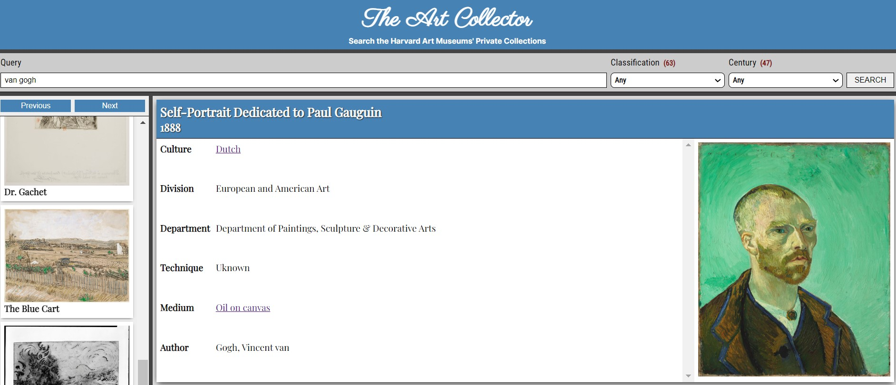

# The Art Collector

## Description

The Art Collector app is a simple search engine for the Harvard Art Museums. it was made in collaboration with Scott Wang.

### `browser interface`

We built this project using:

- React library.
- Harvart Art Museums API.

[visit this site](https://yeisson-art-collector.netlify.app/)
